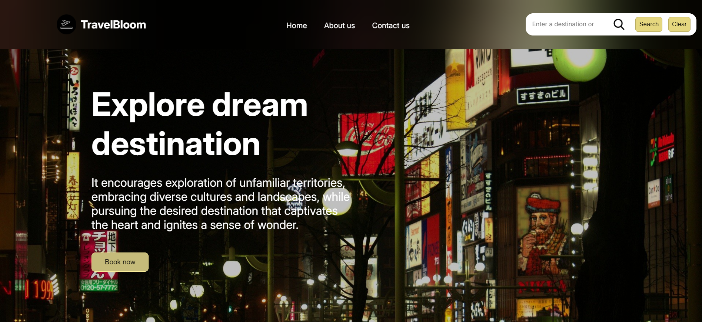
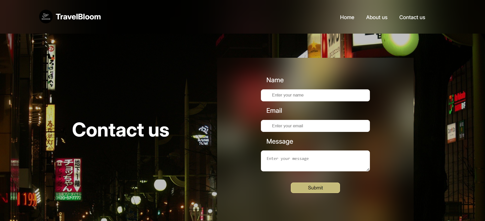

# Travel-recommendation

This is part of IBM's Javascript Programming Essentials. For completion of the course a Travel recommendation site has been made using HTML, CSS and Javascript. It provides recommendations based on countries, temples, beaches etc. 

Here is a live link to the site : https://travel-recommendation239.netlify.app/

Here are a few screenshots from the project:

home page:

Recommendations provided:

About page:

Contact us page:
